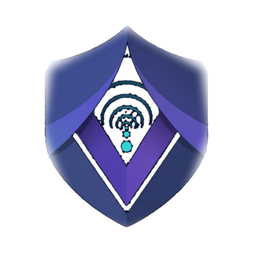

<p align="center">
  
</p>

<h1 align="center">veil-windows</h1>

<p align="center">Windows CLI client for the VEIL private tunnel.</p>

---

`veil-windows` is the Windows command-line client for **VEIL**. It creates a TUN
adapter through VEIL's own driver binding (`veiltun` — no vendored WireGuard Go
code), configures addressing / routes / DNS, and runs the
[VEIL data plane](https://github.com/veil-proto/veil).

This repo also holds the **shared Windows tunnel code** that the
[GUI client](https://github.com/veil-proto/veil-windows-gui) builds on:

| Package | Role |
|---------|------|
| `veiltun` | VEIL-owned binding to the Windows TUN driver (`veiltun.dll`) |
| `winipcfg` | Interface address / route / DNS configuration |
| `windev` | The Windows `TunDevice` (implements `veil/engine.Tun`) + routing |
| `wintunnel` | Reusable tunnel controller (up/down/status), implements `control.Handler` |
| `control` | Local control channel (named pipe) protocol + server/client |
| `cmd/veil-client` | The CLI itself |

Built on [`veil`](https://github.com/veil-proto/veil), pinned at `main`.

## Install

Download `veil-client-windows-amd64.zip` from the latest
[prerelease](https://github.com/veil-proto/veil-windows/releases) (rolling) or a
tagged release. Each zip contains **`veil-client.exe` + `veiltun.dll`** — keep
them in the same folder (the driver is loaded only from the executable's
directory or System32).

## Usage

Run from an **elevated** prompt (adapter creation + routing need admin):

```
veil-client.exe C:\path\to\veil.conf
```

It brings up the `veil0` adapter, pins a host route to the server endpoint over
the physical gateway (so the tunnel's own UDP doesn't loop), applies
`AllowedIPs` routes and DNS, and runs the tunnel. Generate configs / `veil://`
links with [veil-install](https://github.com/veil-proto/veil-install).

For a background service with a GUI, auto-start, and crash-restart, use
[veil-windows-gui](https://github.com/veil-proto/veil-windows-gui).

## The driver

`veiltun.dll` (under `driver/<arch>/`) is currently the signed Wintun driver
renamed. The Go binding around it is VEIL's own. Rebuilding + re-signing the
driver with a VEIL certificate is tracked separately and does not require any
code change here — it's a binary swap.

## Versioning

Calendar versioning `YY.M.D`. Every commit publishes a rolling prerelease;
stable releases are cut manually.

## License

MIT — see [LICENSE](LICENSE). Bundled `veiltun.dll` is the Wintun driver
(redistributable) renamed.
